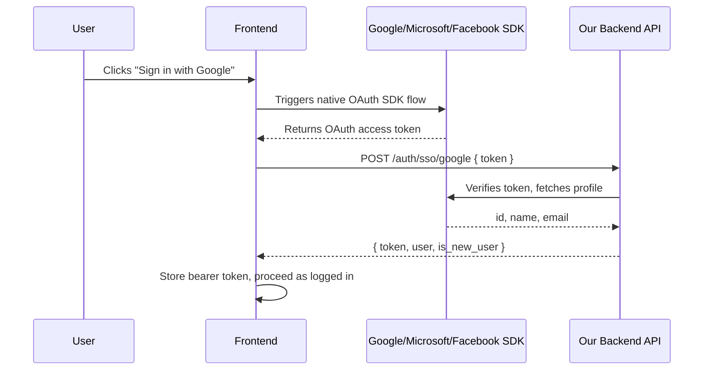

# SSO Login Integration Guide (Frontend)

This document explains how the frontend/mobile client should integrate with the backend's Single Sign-On (SSO) endpoint. The backend supports **Google**, **Microsoft (Azure AD/Entra ID)**, and **Facebook** login via a **token-exchange flow** — there is no server-side redirect/callback to implement.

## How the flow works

1. The frontend uses the provider's **native SDK** (Google Identity Services, MSAL.js, Facebook Login SDK, etc.) to prompt the user to sign in **in the browser/app**.
2. The provider SDK returns an **OAuth access token** directly to the frontend (no page reload, no redirect to our backend).
3. The frontend POSTs that access token to our API: `POST /api/v1/auth/sso/{provider}`.
4. Our API verifies the token directly with the provider (Google/Microsoft/Facebook's own userinfo endpoint), creates or matches the user, and returns a **Sanctum bearer token** — exactly like the existing email/password login.
5. The frontend stores that bearer token and uses it as `Authorization: Bearer <token>` on all subsequent API calls, same as today.



**Important**: You must send an **OAuth access token** (the kind used to call the provider's own APIs, e.g. Google's `userinfo` endpoint), not necessarily an OIDC `id_token`. See per-provider notes below for exactly which token each SDK gives you.

## Endpoint reference

### `POST /api/v1/auth/sso/{provider}`

- **Auth required**: No (this endpoint _is_ the login mechanism).
- **Path parameter**: `provider` — one of `google`, `microsoft`, `facebook`. Any other value returns `404`.
- **Rate limited**: Yes — `10 requests per 1 minute` per IP address (same limit applies to `/auth/login` and `/auth/register`). Exceeding this limit returns `429 Too Many Requests`.

#### Request body

| Field          | Type   | Required | Description                                                                                                                                                                                                                                                                                                                                                                      |
| -------------- | ------ | -------- | -------------------------------------------------------------------------------------------------------------------------------------------------------------------------------------------------------------------------------------------------------------------------------------------------------------------------------------------------------------------------------- |
| `token`        | string | Yes      | The OAuth access token obtained from the provider's SDK on the frontend.                                                                                                                                                                                                                                                                                                         |
| `invite_token` | string | No       | An event's `invite_token` (the same token used in the public event landing page URL, e.g. `https://app.example.com/events/{invite_token}`). If provided, and the caller turns out to be a **brand-new user**, their `organization_id` is set from that event's organization. See [Invite token / event registration behavior](#invite-token--event-registration-behavior) below. |

```json
{
    "token": "ya29.a0AfH6SMC...",
    "invite_token": "optional-event-invite-token"
}
```

#### Responses

**`201 Created`** — a new user account was created:

```json
{
    "token": "1|abcdef1234567890...",
    "user": {
        "id": 42,
        "name": "Jane Doe",
        "email": "jane@example.com",
        "role": "attendee",
        "organization_id": null,
        "organization": null,
        "photo_urls": null,
        "created_at": "2026-09-08T12:00:00.000000Z",
        "updated_at": "2026-09-08T12:00:00.000000Z"
    },
    "is_new_user": true
}
```

**`200 OK`** — an existing user was matched and logged in (identical shape, `is_new_user: false`):

```json
{
    "token": "1|abcdef1234567890...",
    "user": { "...": "same shape as above" },
    "is_new_user": false
}
```

**`401 Unauthorized`** — the token could not be verified with the provider (expired, invalid, wrong audience, network error talking to the provider, etc.):

```json
{ "message": "Unable to verify SSO token." }
```

Action: prompt the user to try signing in again; the provider token may have expired between obtaining it and calling our API.

**`404 Not Found`** — `{provider}` path segment is not one of `google`, `microsoft`, `facebook`. This should never happen in production if the frontend only exposes buttons for supported providers — treat it as a client bug if seen.

**`422 Unprocessable Entity`** — the provider did not return an email address for the user:

```json
{ "message": "Email permission is required to sign in." }
```

Action: this happens if the user denied the email scope/permission during the provider's consent screen, or the provider account has no verified email. The frontend must request the email scope explicitly (see per-provider notes) and should show a message asking the user to grant email access, or fall back to password login/registration.

**`422 Unprocessable Entity`** — standard Laravel validation error if `token` is missing from the request body:

```json
{ "message": "The token field is required." }
```

**`429 Too Many Requests`** — rate limit exceeded (10 requests per 1 minute from this IP address):

```json
{ "message": "Too Many Requests" }
```
Action: exponential backoff; inform the user they are attempting to sign in too frequently and should wait a minute before trying again.

## Using the returned token

Identical to the existing `/auth/login` flow — no special handling needed:

```
Authorization: Bearer 1|abcdef1234567890...
```

Store it the same way you already store the token from `POST /auth/login` (e.g. secure storage / httpOnly-equivalent for mobile, memory + refresh strategy for web). `is_new_user` is provided purely as a UI hint (e.g. to show an onboarding/welcome screen for first-time sign-ups) — it has no bearing on how the token itself is used.

## Account matching & provisioning behavior (read before building UI)

On every call, the backend resolves the user in this priority order:

1. **Existing linked identity**: if this exact provider + provider-account combination has signed in before, the same `User` is returned (existing `organization_id`, `role`, etc. are untouched).
2. **Existing user by email**: if no linked identity exists yet, but a `User` already exists with the same email address (e.g. **staff accounts** — Org Admin, Checker, Super Admin — created manually by an administrator through the admin panel), the SSO identity is linked to that existing account and they are logged into their existing role/organization. **This is how staff use SSO** — an admin creates their account first (with their email), and the first SSO login automatically links it.
3. **Brand new user**: if neither match is found, a new `User` is created with:
    - `role`: always `attendee` (SSO signup never creates staff accounts — those must be pre-created by an admin, see point 2)
    - `organization_id`: `null`, unless `invite_token` was provided and resolves to a published event (see below)
    - `email_verified_at`: set immediately (the provider already verified the email)
    - a random, never-used password is set internally (irrelevant to the frontend — this account can only be accessed via SSO or a future "set password" flow, not via `/auth/login`, unless the user later sets one)

All three roles (Attendee, Checker, Org Admin, Super Admin) can use SSO — for staff, it's purely an alternative login method to their existing password login, not a separate account.

## Invite token / event registration behavior

`invite_token` is the **event's** invite token (the same one used to render the public event page, e.g. from a link like `https://yourapp.com/events/{invite_token}`).

- If passed, and the event lookup succeeds (must be a real invite token AND the event's status is `published`), and the resolved user's `organization_id` is currently `null` (true for all brand-new signups, and also true for any existing user who never had an org assigned), their `organization_id` is set to that event's `organization_id`.
- **This endpoint does NOT create an `Attendee` record or `EventRegistration` for the user.** It only authenticates and (optionally) sets their organization. After receiving the token from this endpoint, if you want to actually register the user for that event, call the existing endpoint next:

    ```
    POST /api/v1/public/event/{eventInviteToken}/register
    Authorization: Bearer <token from the SSO response>
    ```

    This is the same endpoint used today for authenticated event self-registration; it creates the `Attendee` + `EventRegistration` + triggers ID card/QR generation.

**Typical "join event via SSO" flow for the frontend:**

1. User opens an event invite link → you show the public event landing page (`GET /public/event/{token}` — no auth).
2. User clicks "Sign in with Google" (or Microsoft/Facebook) to register.
3. Frontend gets the provider access token → `POST /auth/sso/google` with `{ token, invite_token: <the event's invite token from the URL> }`.
4. Frontend receives the bearer token → immediately calls `POST /public/event/{token}/register` with that bearer token to complete registration.
5. If invalid/unknown `invite_token` is passed, it is silently ignored (no error) — `organization_id` simply stays `null` and the subsequent register call will still work using the event context from the URL itself.

## Per-provider frontend setup notes

### Google

- Use [Google Identity Services](https://developers.google.com/identity/gsi/web) (`accounts.google.com/gsi/client`) or the native Android/iOS Google Sign-In SDK.
- You need an **OAuth access token** (not just the `id_token` credential you get from the basic "Sign in with Google" button/One Tap flow). Use the **OAuth2 token flow** (`google.accounts.oauth2.initTokenClient`) or, in the credential flow, exchange for an access token via your chosen SDK's token client APIs.
- Required scope: `email` (and typically `profile` for the display name) — e.g. `openid email profile`.
- `GOOGLE_CLIENT_ID` is configured on the backend already; ask the backend team for the client ID to use in the frontend SDK config (must match, since Google validates the token's audience against the same client).

### Microsoft (Azure AD / Entra ID)

- Use [MSAL.js](https://github.com/AzureAD/microsoft-authentication-library-for-js) (web) or MSAL for iOS/Android.
- Acquire an **access token** for the Microsoft Graph API (`https://graph.microsoft.com/User.Read` scope at minimum) via `acquireTokenPopup`/`acquireTokenSilent` — this is the token to send to our API, not the `id_token`.
- Required scope: `User.Read` (grants access to the user's basic profile + email via Graph's `/me` endpoint, which is what our backend calls to verify the token).
- Backend is configured against a specific tenant (`MICROSOFT_TENANT`, defaults to `common` for multi-tenant). Confirm with the backend team whether your app registration should be single-tenant or multi-tenant to match.

### Facebook

- Use the [Facebook Login SDK for JavaScript](https://developers.facebook.com/docs/facebook-login/web) or native SDKs.
- After `FB.login(...)`, use the `accessToken` from the response's `authResponse` — this is the token to send to our API.
- Required permission: `email` — must be explicitly requested in the `FB.login({ scope: 'email' })` call, otherwise Facebook will not return an email and the backend will respond with `422`.
- Facebook does not always return an email even when granted (e.g. accounts without a verified email) — handle the `422` response gracefully with a fallback to password login/registration.

## Error handling checklist for the frontend

| Scenario                                             | HTTP status                 | Frontend behavior                                                                                |
| ---------------------------------------------------- | --------------------------- | ------------------------------------------------------------------------------------------------ |
| Provider popup/SDK cancelled by user                 | N/A (no API call made)      | No-op, return to login screen                                                                    |
| Token expired/invalid by the time it reaches our API | `401`                       | Show generic "sign-in failed, please try again" and restart the provider flow                    |
| User denied email permission / provider has no email | `422`                       | Show message asking to grant email access, or offer password login/registration as fallback      |
| Missing `token` in request body (client bug)         | `422`                       | Should never happen if the frontend always includes `token`; treat as a bug                      |
| Rate limit exceeded (too many login attempts)        | `429`                       | Show message asking user to wait a minute before trying again; implement exponential backoff     |
| Unsupported provider in URL (client bug)             | `404`                       | Should never happen if only exposing buttons for `google`/`microsoft`/`facebook`; treat as a bug |
| Success, first-time user                             | `201`, `is_new_user: true`  | Optionally show a welcome/onboarding screen                                                      |
| Success, returning user                              | `200`, `is_new_user: false` | Proceed straight to the app as normal login                                                      |

## Summary of what the backend needs from you (checklist)

- [ ] Google Cloud OAuth client ID configured in the frontend SDK (coordinate with backend to match `GOOGLE_CLIENT_ID`).
- [ ] Microsoft Azure app registration configured in MSAL (coordinate tenant type with backend's `MICROSOFT_TENANT`).
- [ ] Facebook App ID configured in the Facebook SDK.
- [ ] All three provider flows request the **email scope/permission** explicitly.
- [ ] Send the OAuth **access token** (not `id_token`) to `POST /auth/sso/{provider}`.
- [ ] Handle `401`/`422` gracefully per the table above.
- [ ] For event-invite sign-ups, pass `invite_token` and follow up with `POST /public/event/{token}/register` using the returned bearer token.
